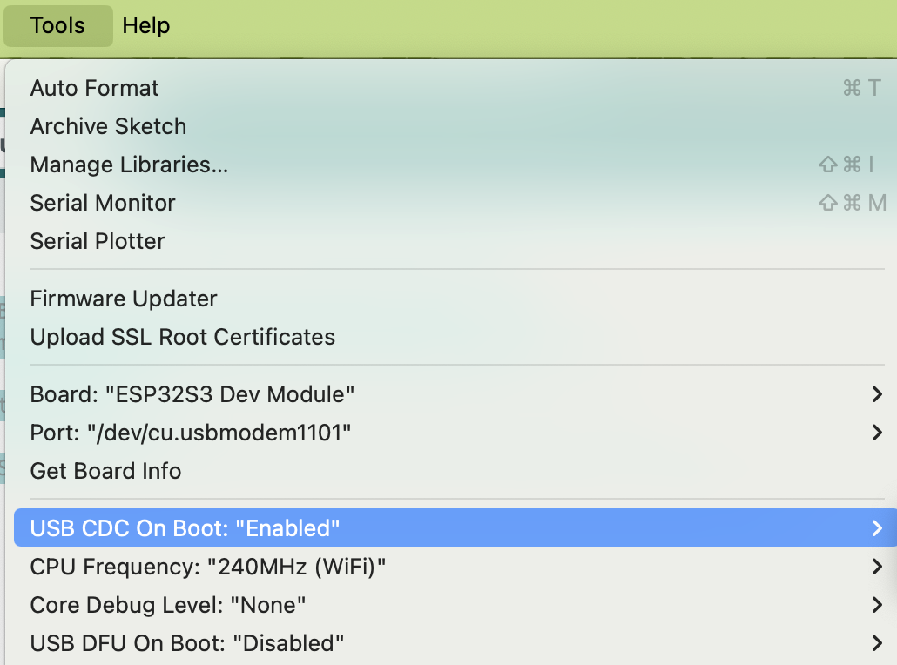

ESP32-S3
========

Using USB Port as Serial Output
-------------------------------

USB CDC (USB Communications Device Class) is a protocol that allows the ESP32-S3 USB port to operate like a serial port, facilitating basic communication.

By default, serial output (serial.println) is routed through the UART port. To configure the USB port for serial output in the Arduino IDE, please follow these steps:

#. Open the Arduino IDE.
#. Go to the Tools menu.
#. Select "USB CDC on boot" and ensure it is enabled.

Once enabled, Serial.print commands will send output through the USB port instead of the UART port.

.. code-block:: console

   (.venv) $ pip install lumache